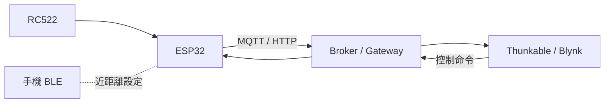

# 前導技術概要

## 總資料流

```mermaid
flowchart LR
    E[ESP32] -->|MQTT / HTTP| G[Broker / Gateway]
    R[RC522] --> E
    G --> A[Thunkable / Blynk]
    A -->|控制命令| G
    G --> E
    M[手機 BLE] -.近距離設定.- E
```

先理解每個通訊邊界，再進行硬體整合。每個子頁都保留獨立的輸入、處理與輸出資料流。
