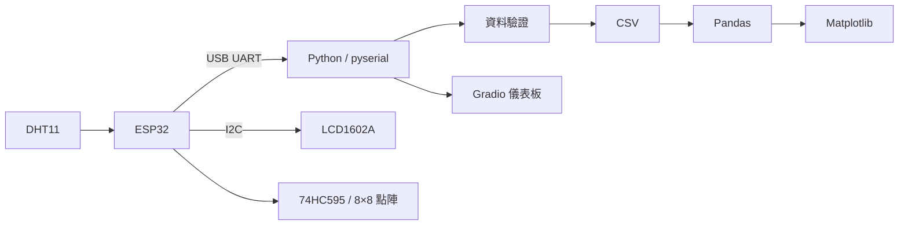

# 學習筆記

## Python、ESP32、資料與 App 的整合路線

這是一份可持續擴充的 AIoT 學習筆記。從 ESP32 讀取 DHT11 開始，逐步建立 UART 通訊、資料儲存、圖表、LCD、點陣、Gradio、API 與手機 App 的整合能力。

!!! abstract "閱讀方式"
    先依序完成 **主線課程 01～08**。遇到程式、通訊、資料品質或除錯問題，再進入對應的延伸選讀。MQTT、RC522、FastAPI、ngrok、Thunkable 與 BLE 屬於選做專題。

## 總資料流 {#data-flow}



## 學習時間軸 {#timeline}

<div class="timeline">

1. **建立環境**：用 `uv` 管理 Python 專案與套件。
2. **理解資料流**：分清感測、韌體、傳輸、儲存與介面責任。
3. **完成 UART**：讓 Python 與 ESP32 雙向傳遞資料與命令。
4. **保存與分析**：把感測資料寫入 CSV，產生趨勢圖。
5. **加入硬體顯示**：以指定腳位整合 LCD1602A 與裸 8×8 點陣。
6. **建立儀表板**：使用 Gradio 讀取資料並提供控制入口。
7. **完成整合專題**：讓資料從感測器一路流向儲存、圖表與介面。

</div>

## 硬體基準 {#hardware}

| 模組 | 本筆記基準 | 用途 |
| --- | --- | --- |
| ESP32 DevKit | Arduino IDE | 控制核心 |
| DHT11 | 感測資料腳位沿用已驗證的 GPIO 4 | 溫度與濕度 |
| LCD1602A I2C | SDA GPIO 21、SCL GPIO 22、核心供電 3V3 | 兩行文字顯示 |
| 74HC595 + 裸 8×8 點陣 | 依主線頁面的行列與移位配置 | 圖樣掃描 |
| RC522 | SPI 與 `SS`／`RST` 依專題頁核對 | RFID 卡片讀取 |
| MAX7219 | 選做模組，與裸點陣主線分開 | 點陣驅動比較 |

LCD 的 I2C 位址必須先由掃描器確認，常見值 `0x27` 或 `0x3F` 不能直接當成 GPIO 使用。硬體頁面均以參考教材的接線與安全說明為準。

## 章節入口 {#roadmap}

| 路線 | 適合什麼時候讀 | 入口 |
| --- | --- | --- |
| 主線課程 | 第一次完整學習 | [開始主線](main/01-uv.md) |
| 主線延伸 | 想理解已完成程式 | [序列通訊與整合](extensions/uart-json.md) |
| 通用延伸 | 補強 Python、資料與網路 | [Python 程式設計](general/python-pathlib.md) |
| 進階專題 | 已完成主線並有額外硬體 | [專題總覽](advanced/index.md) |
| 新增筆記 | 未來增加自己的主題 | [新增筆記模板](supplemental/template.md) |

## 版本化資料流

每篇筆記都採用相同順序：

```text
學習目標 → 先備知識 → 本頁資料流 → 核心概念 → 任務 → 輸入／輸出 → 除錯 → 延伸
```

這讓未來新增硬體、App 或後端主題時，不必重做整個網站導覽。

## 下一步

前往 [01｜用 uv 建立 Python 虛擬環境](main/01-uv.md)，先建立可重現的 Python 工作環境。
