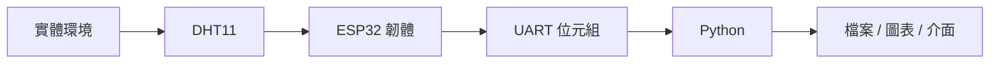

# 02｜課程準備：認識 AIoT 資料流

## 本頁資料流

## 核心概念

一個可除錯的系統，要把「感測」「傳輸」「解析」「儲存」「呈現」分開。若畫面沒有資料，應沿資料流逐段確認，而不是一次更換所有程式。

| 層 | 責任 | 觀察方式 |
| --- | --- | --- |
| 感測 | DHT11 產生溫度與濕度 | ESP32 序列輸出 |
| 韌體 | 讀值、格式化與控制硬體 | Arduino Serial Monitor |
| 傳輸 | USB UART 傳送位元組 | pyserial 原始資料 |
| Python | 解碼、驗證與保存 | 終端機與 log |
| 介面 | 圖表、LCD、Gradio | 使用者可見結果 |

## 任務

1. 確認 ESP32 能上傳 Blink。
2. 確認 DHT11 已能讀值。
3. 記錄每一層的輸入與輸出。
4. 再進入 [UART 雙向通訊](03-uart.md)。

## 觀念檢查

`DHT11 → ESP32 → USB UART → Python → CSV／圖表／Gradio` 是主線總資料流；LCD 與點陣是 ESP32 端的顯示分支。
