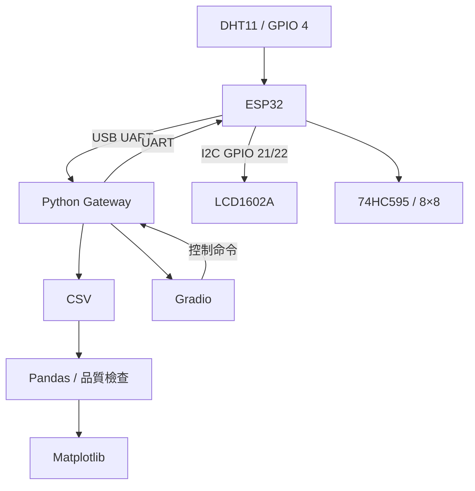

# 08｜整合專題：完成環境看板

## 完整資料流

## 建置順序

1. 先讓 DHT11 單獨穩定讀值。
2. 再驗證 UART 單向資料。
3. 加入 CSV，確認資料可重播。
4. 加入 LCD 與點陣等 ESP32 端輸出。
5. 建立 Gradio 讀取與控制事件。
6. 以故障分流頁逐層測試。

## 完成條件

- 感測資料有時間戳記並可保存。
- 圖表能反映資料，而不是只顯示假資料。
- LCD 與點陣的腳位、電壓、方向已驗證。
- UI 的控制命令有回應或錯誤狀態。
- 每一層都能獨立診斷。

前往 [整合專題故障分流](../extensions/troubleshooting.md)。
