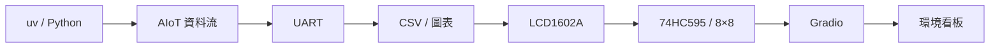

# 主線課程

主線是從環境準備到完整環境看板的循序學習路線。請依序完成 01～08，每一章都會把上一章的資料流往下一層延伸。

## 主線總資料流

## 建議順序

| 順序 | 主題 | 產出 |
| --- | --- | --- |
| 01 | Python 環境 | 可重現的專案 |
| 02 | AIoT 資料流 | 系統分層概念 |
| 03 | UART | Python 與 ESP32 雙向資料 |
| 04 | CSV 與圖表 | 可保存、可分析的感測資料 |
| 05 | LCD1602A | ESP32 端即時文字顯示 |
| 06 | 74HC595 點陣 | ESP32 端圖樣輸出 |
| 07 | Gradio | 本機瀏覽器儀表板 |
| 08 | 整合專題 | 完整環境看板 |

## 章節入口

- [01｜用 uv 建立 Python 虛擬環境](01-uv.md)
- [02｜課程準備：認識 AIoT 資料流](02-data-flow.md)
- [03｜UART：Python 與 ESP32 雙向通訊](03-uart.md)
- [04｜將感測資料存成 CSV 並繪製趨勢圖](04-csv-chart.md)
- [05｜I2C：LCD1602A 與 DHT11](05-i2c-lcd.md)
- [06｜74HC595 與裸 8×8 點陣](06-matrix.md)
- [07｜Gradio AIoT 儀表板](07-gradio.md)
- [08｜整合專題：環境看板](08-dashboard.md)

完成主線後，前往[主線延伸](../extensions/index.md)深入理解程式與除錯。
